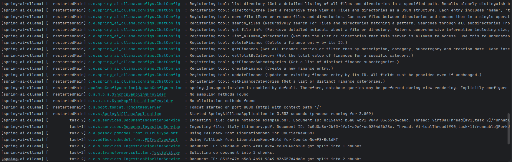
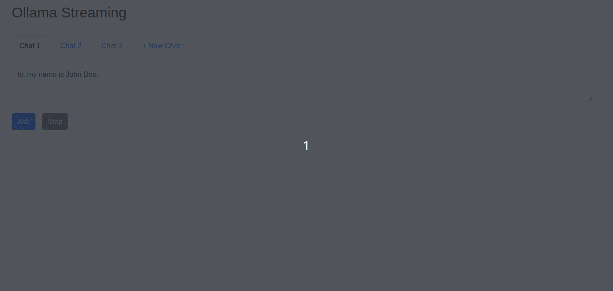
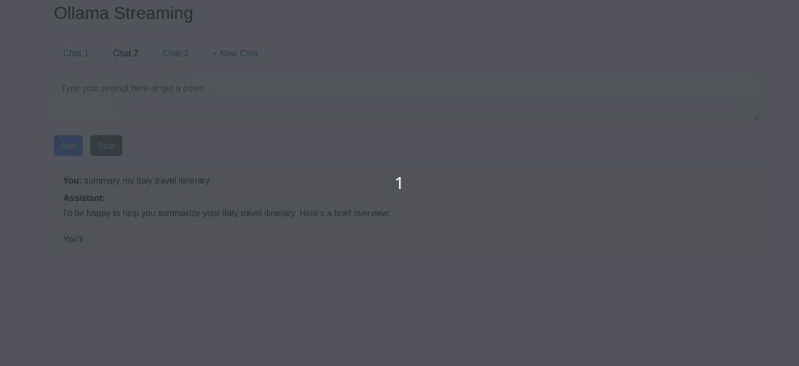
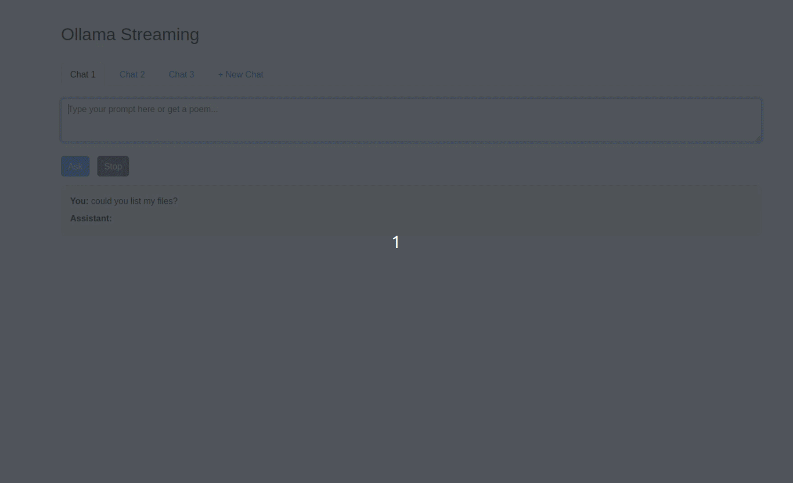
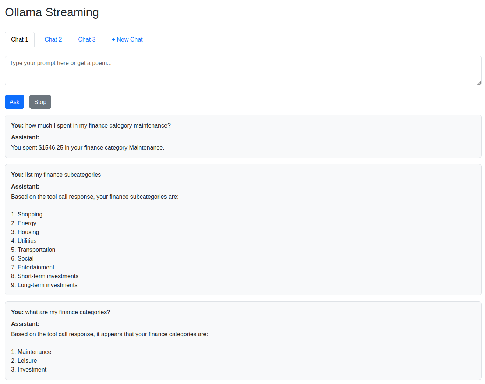

# Spring AI Ollama
This project is a Spring Boot application that integrates with Ollama, an AI platform.

See [Spring AI Knowledge](spring-ai-knowledge.md) for more details about the Spring AI APIs and how they are used in this application.

## Running the Application
### Ollama
To run Ollama with Docker, you can use this repository: [egon89/docker-mono-repo/ollama](https://github.com/egon89/docker-mono-repo/tree/main/ollama)

### PostgreSQL PGVector
To run PostgreSQL with PGVector extension using Docker,
you can use this repository: [egon89/docker-mono-repo/postgresql/pgvector](https://github.com/egon89/docker-mono-repo/tree/main/postgresql/pgvector)

It will create the `pgvectordb` database and runs an initialization script that create the `vector_store` table.
The `vector_store` is used to store the vectors for the RAG functionality.

### Finance control MCP Server
The application has an MCP client that connects to an MCP server for financial control. You can run the MCP server
using this repository: [egon89/finance-control-mcp-server](https://github.com/egon89/finance-control-mcp-server)

To run the MCP server, you can use the following gradle command:
```bash
./gradlew bootRun
```

### Application
Create a `.env` file based on the `.env.example` and fill with the appropriate values for your environment:
```bash
cp .env.example .env
```

To run the application, you can use the make command that will set the environment variables from the
`.env` file and run the application using gradle:
```bash
make run
```

Another option is using the command:
```bash
export $(grep -v '^#' .env | xargs) && ./gradlew bootRun
```



---

## Features
### Memory chat
Each **chat tab** in the application maintains its own conversation history using the `MessageWindowChatMemory`
implementation of the Chat Memory API. This allows the AI to remember previous interactions within the same chat tab 
and provide more contextually relevant responses.




### RAG (Retrieval-Augmented Generation)
The application uses RAG to enhance the AI's responses by retrieving relevant information from a vector store. 
You can use some documents to test the RAG functionality in `src/main/resources/rag-documents`. 

The application will load the documents in `RAG_DOCUMENTS_PATH` into the vector store using the
[Spring AI ETL Pipeline framework](https://docs.spring.io/spring-ai/reference/api/etl-pipeline.html) and use them to provide more accurate and contextually relevant responses to
user queries.

The application will load the documents on startup and also provides a watch service that monitors the
`RAG_DOCUMENTS_PATH` for new documents.

This example demonstrates the response considering the document `resources/rag-documents/italy_itinerary.pdf`:



### Filesystem MCP Tool
The application includes a custom MCP tool that allows the AI to interact with the filesystem.



### Finance Control MCP Tool
The application includes a custom MCP tool that allows the AI to interact with the finance control MCP server:



### Liquibase
The application uses Liquibase for database migrations. The changelog files are located in `src/main/resources/db/changelog`.
The application will automatically run the migrations on startup in the `pgvectordb` database
that was created by the PostgreSQL PGVector Docker container.
